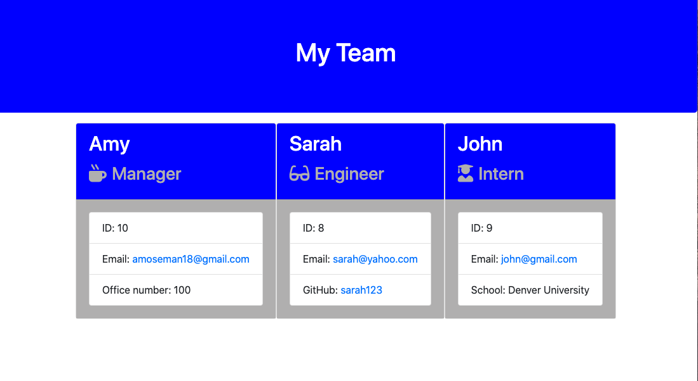

# Employee Template Generator

## Description

This is an application that runs a CLI interface with node JS to be able to log in as a manager and add interns or engineers to your team with their contact information, and have an html page generated with links to their email adresses and github accounts for engineers

## Table Of Contents:

-[Installation](#Installation)   -[Usage](#Usage)   -[Liscense](#Liscense)   -[Contributing](#Contributing)   -[Tests](#Tests)   -[Questions](#Questions)

## Installation

npm i the dependencies

## Usage

need to install the dependency packages and run node app.js to prompt the questions

## Liscense

For more information about the liscense chosen, follow the link below:
[Liscense](https://opensource.org/liscenses/MIT)

## Contributing

Amy Moseman

## Tests

To run the tests enter - 'npm test' in nodeJs
This is what the passed tests should look like:

## Questions

If you have any questions about this repo, open an issue or contact me directly at **amoseman18@gmail.com**.  
You can find more of my work at Github: [amoseman1](https://github.com/amoseman1/)

## Link to the viedo of the funtionality of the interface

[demonstration](https://drive.google.com/file/d/1ln3IedVVDCalSRFas2ydxZyAn1Xo69hc/view)

## Screenshot of the generated HTML

